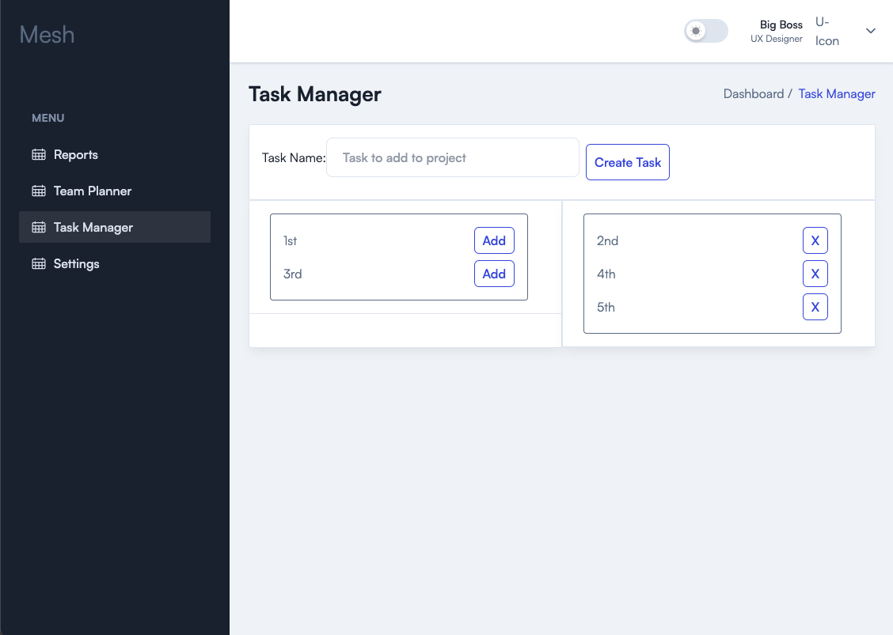

# Mesh: Team Capacity planner


  ---
  ## Table of Contents
  1. [Title](#title)
  2. [Description](#description)
  3. [Installation](#installation)
  4. [Contributing](#contributing)
  5. [Author](#author)
  6. [Questions](#questions)
  
  ---
  ## Description
Mesh is designed to be a comprehensive team capacity manager. The inspiration for its development came from observing the difficulty my wife faced when trying to determine her team's monthly capacity and forecast future capabilities – a process that was far from optimal.

The application's development began with Remix as the framework, utilizing a custom Express backend to interface with a MongoDB database, and Tailwind for CSS stylings.

Being my first experience with TypeScript, Tailwind, and Remix, I inevitably ran into some roadblocks. In the initial version, I faced significant challenges with Remix-specific components not functioning as expected. Upon analysis, I inferred that these issues likely originated from my initial configuration.

Opting for a full rebuild with a revised configuration, I managed to overcome these problems, reusing much of the original codebase. This rebuild, however, introduced a new issue with Remix V2 Routing – a feature that I decided to embrace for its novelty and appeal.

In the midst of all this, I was deepening my understanding of how Remix operates and appreciating the benefits of having the browser render pages while relegating all business logic to the backend. I also began to see the advantages of forgoing the setup of an Express server in favor of using a Remix server and Prisma to interact with my database. This shift allowed me to fully leverage Remix's "Optimistic UI".

As I navigated these changes, I realized I was accumulating a substantial amount of technical debt, even before the project truly took off. Consequently, I decided to close the current repository and undertake a full rebuild with the new structure. While this decision required significant effort upfront, it facilitated the acceleration of development and laid the groundwork for a project that adheres to best practices.

In this endeavor, my primary focus remains creating a user-friendly tool that significantly improves the efficiency of team capacity planning and forecasting.

---




See the application's GitHub repository [here.](https://github.com/Kokkonut/react-portfolio)

  ## Installation
  Clone my repository on GitHub.
  
  To install the application's `dependencies` and `devDependencies`, run:
  ```
  npm install
  ```
  
  To invoke the application, run:
  ```
  npm run start
  ```

  ---
  ## Contributing
As this Repo is closed there are no contributions at this stage.

  ---
  ## Tests
  During development, the application is tested using `localhost`.

  ---
  ## Author
  Nicolas Fraenkel

  ---
  ## Questions
  For questions or issues, please contact: 
  - Nicolas Fraenkel
  - Email: nicfraenkel@gmail.com
  - GitHub Username: Kokkonut
  - GitHub Profile: https://github.com/Kokkonut

  ---

  ## My Git

[](https://github.com/Kokkonut/github-readme-stats)

[](https://github.com/Kokkonut/github-readme-stats)
